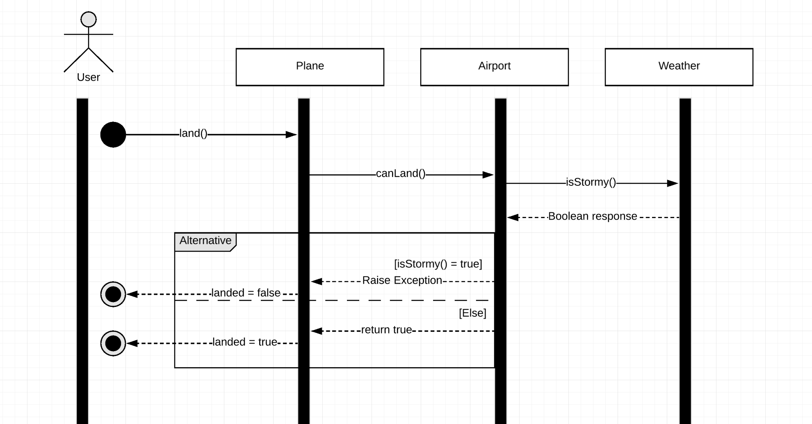
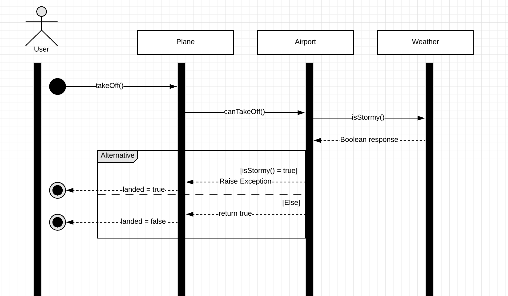

# Traffic controller

With this app you can instruct flights to land and to take off.

## Running tests
In the terminal write `open SpecRunner.html`

## Using the App

```
With the SpecRunner.html file opened in the browser, click the page with the right mouse button and select inspect
then select console from the options, with console opened you can try landing and taking off planes.

to create an airport:
var airportName = new Airport('airportName')

to create a plane:
var planeName = new Plane('planeName')

to instruct a plane who wants to land:
aiportName.canLand(planeName)

to instruct a plane who wants to take off:
aiportName.canTakeOff(planeName)

to change airport capacity:
aiportName.capacity = capacityNumber

to check airport hangar:
aiportName.hangar

to land a plane:
planeName.land(aiportName)

to take off plane:
planeName.takeOff(aiportName)

to check if airport is saved inside plane:
planeName._isLandedAt

to check if plane is landed:
planeName.landed


*P.S Weather condition is randomly generated. It will throw and error if you try to land or take off when the weather happens to be Stormy.

```

## Landing User Stories
```
As an air traffic controller
So I can get passengers to a destination
I want to instruct a plane to land at an airport
```

##### Running this user story on browser console:
var cityAirport = new Airport('City')\
var airFrance784 = new Plane('Air France 784')\
airFrance784.land(cityAirport)\
airFrance784.landed\
*Should return true if plane successfully landed
----

```
As an air traffic controller
To ensure safety
I want to prevent landing when weather is stormy
```

##### Running this user story on browser console:
var cityAirport = new Airport('City')\
var airFrance785 = new Plane('Air France 785')\
airFrance785.land(cityAirport)
*Weather is randomly chosen, if it returns 'Stormy'\
*it should throw an error `Uncaught Error: Air France 785 cannot land due to bad weather`\
airFrance785.landed\
*Should return false if weather was stormy
----

```
As an air traffic controller
To ensure safety
I want to prevent landing when the airport is full
```
##### Running this user story on browser console:
var cityAirport = new Airport('City')\
cityAirport.capacity = 1\
var airFrance786 = new Plane('Air France 786')\
var ryanair780 = new Plane('Ryanair 780')\
airFrance786.land(cityAirport)\
ryanair780.land(cityAirport

*First change airport capacity to 1 so you don't need to create too many planes\
*When trying to land more than one plane is should throw an error `Uncaught Error: Ryanair 780 cannot land due to airport full hangar`

----

```
As an air traffic controller
To ensure right information
I want to prevent logging a plane that is already in the airport
```

##### Running this user story on browser console:
var cityAirport = new Airport('City')\
var airFrance787 = new Plane('Air France 787')\
airFrance787.land(cityAirport)\
airFrance787.land(cityAirport)\
*Should throw an error `Uncaught Error: Cannot land, because plane is already landed`

## Take Off User Stories

```
As an air traffic controller
So I can get passengers on the way to their destination
I want to instruct a plane to take off from an airport and confirm that it is no longer in the airport
```

##### Running this user story on browser console:
var cityAirport = new Airport('City')\
var airFrance788 = new Plane('Air France 788')\
airFrance788.land(cityAirport)\
airFrance788.takeOff(cityAirport)\
airFrance788.landed\
*It should return false if plane has successfully taken off\
cityAirport.hangar\
*Air France 788 should not be in the hangar
----

```
As an air traffic controller
To ensure safety
I want to prevent taking off when weather is stormy
```

##### Running this user story on browser console:
var cityAirport = new Airport('City')\
var airFrance789 = new Plane('Air France 789')\
airFrance789.land(cityAirport)\
airFrance789.takeOff(cityAirport)

*Weather is randomly chosen, if it returns 'Stormy' when taking off \
*Should throw an error `Uncaught Error: Airfrance 789 cannot take off due to bad weather`

----

```
As an air traffic controller
To ensure right information
I want to prevent logging a plane take off that is not in the airport
```

##### Running this user story on browser console:
var gatwickAirport = new Airport('Gatwick')\
var airFrance790 = new Plane('Air France 790')\
airFrance790.takeOff(gatwickAirport)

*Should throw an error `Uncaught Error: Cannot take off, because plane has already taken off or is not in this airport`

##### My approach
I followed a TDD process, where I would write a test and write minimal code to fix the error message
until my test was green.
I did that for all user stories, after I had finished my initial stories I found the need
to refactor my code inside Airport class so that I could encapsulate some methods and make it easier to read and change.
Since I was mocking the plane for Airport tests, after I finished testing for it, I decided to create a Plane class that
would call airport methods to get permission to land and to take off.
I also followed TDD and mocked Airport method to test it. \
My design was that the user using console or terminal would create an airport and a plane. The user then
would ask the plane to land or take off, the plane would then ask that permission to Airport, Airport needed
to check with Weather if it is stormy, Weather would return a boolean to Airport if the weather was indeed stormy
Airport would raise an error and plane landed state would continue to be the same, if the weather was not stormy
Airport would return true, confirming that it could land or take off, then plane landed state would be updated and airport
stored inside plane. \
First I was naming my Airport methods as instructPlaneToLand and instructPlaneToTakeOff, but since I was returning a
boolean it felt more appropriate to call it canLand or canTakeOff. \
User should not be calling Airport canLand and canTakeOff directly, it can only ask plane to land and take off and wait for
the Airport response. \
I also spot a mistake on my modelling and TDD my way to fixing it. Since my code was easy to change, it was fairly easy to do it.


##### Dependencies
I've used dependency injection of Weather inside Airport, as Airport is dependent on it to allow or deny landing or 
taking off.
Since I can have multiple planes and airports, airplane and plane could not be injected on each other. The Plane needs 
to call Airport methods, when creating a new Plane object user needs to pass as an argument the name of the plane so that 
airport can identify the plane in their hangar. 
This makes it easy to unit test and Airport can have many planes.
So that Plane can land at other Airports, it will specify the Airport it wants to land or take off, like that
Plane can know which Airport it is landed and control errors like asking to take off from an Airport it is not landed.

##### Land flow


##### Take Off flow


